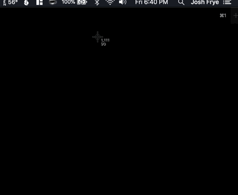

# Screenshot Uploader

A simple go program for MacOS that watches for screenshots and uploads them to s3. A random, short object key is generated for the image and the s3 url is automatically copied to your clipboard, along with a native notification when the upload completes



## Setup

This program assumes you have an aws config file. Next create a file in your home directory called .screenshot-uploader:

```.env
AWS_REGION=us-east-1
AWS_PROFILE=default
AWS_CONFIG_FILE=/full/path/to/.aws/config
S3_BUCKET=i.joshfrye.com

# leave blank to use default s3 url, only set if you have a cname record
S3_HOST=http://joshfrye.com

# any new .png added here will be uploaded
SCREENSHOT_LOCATION=/Users/josh/Desktop
```

## TODO

- Menu bar item
